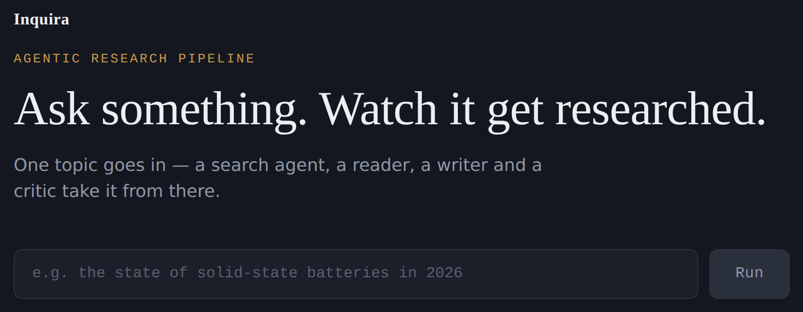
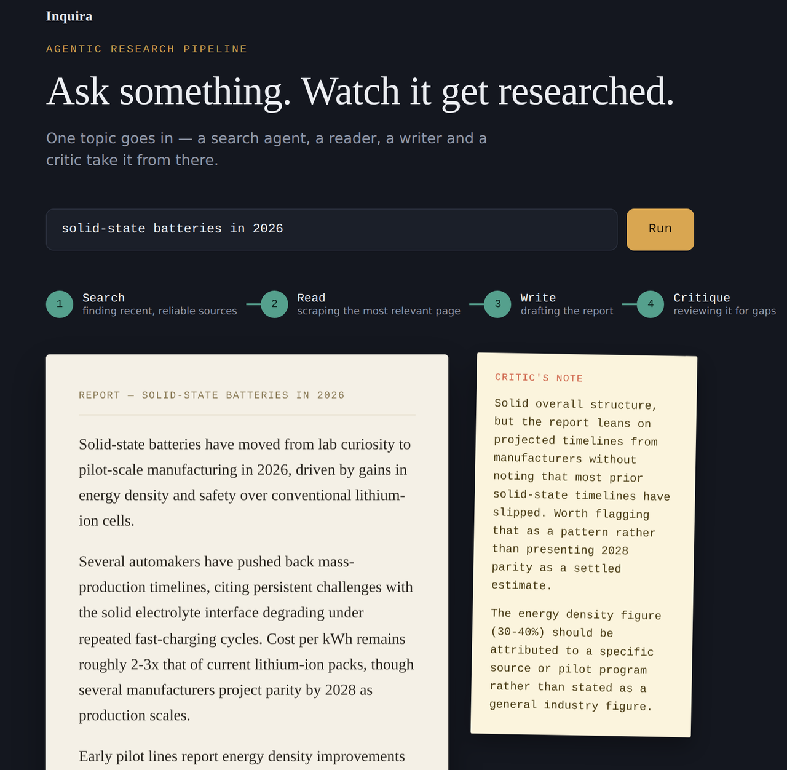
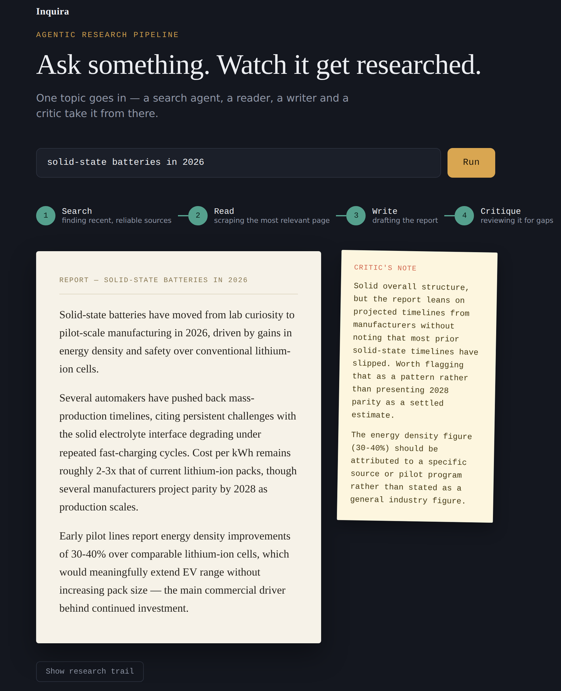

<div align="center">

# ✨ Inquira

**An agentic research pipeline.** Give it a topic — four agents research, write, and critique a report on it, live.

[](https://inquira-five.vercel.app/)
[](https://fastapi.tiangolo.com/)
[](https://vitejs.dev/)
[](https://www.langchain.com/)

**[🔗 Live Demo](https://inquira-five.vercel.app/)** · **[🐛 Report a bug](../../issues)**

<br>



</div>

<br>

## 🧠 What it does

Type in a topic. Four agents take it from there, one after another:

```
📝 topic
   │
   ▼
🔍 Search Agent    → finds recent, reliable sources on the web
   │
   ▼
📖 Reader Agent    → picks the most relevant result and scrapes it for detail
   │
   ▼
✍️  Writer Chain    → drafts a report grounded in what was actually found (RAG)
   │
   ▼
🧐 Critic Chain    → reviews the draft and flags gaps or weak claims
   │
   ▼
📄 report + critic's note, shown in the UI
```

The UI shows the pipeline advancing stage by stage —

<div align="center">

</div>

— then lands on the finished report next to the critic's feedback, styled like a manuscript page with an editor's margin note.

<div align="center">

</div>

## 💡 Why

Most "AI writes your report" tools are one prompt to one model. Inquira splits the job across specialized agents instead — a search step, a dedicated reader that scrapes real content, a writer that's grounded in that content rather than the model's own memory, and a critic that reviews the result. Closer to how an actual research process works.

## 🛠️ Tech stack

| Layer | Stack |
|---|---|
| 🤖 Agents / orchestration | LangChain, LangGraph |
| 🧩 LLM | Mistral |
| ⚙️ Backend | FastAPI (Python) |
| 🎨 Frontend | React + Vite |
| ☁️ Deployment | Render (backend), Vercel (frontend) |

## 📁 Project structure

```
.
├── agents.py              # search agent, reader agent, writer/critic chains
├── pipeline.py             # orchestrates the four-stage pipeline
├── tools.py                 # tools used by the agents (search, scraping, etc.)
├── api.py                    # FastAPI wrapper exposing the pipeline over HTTP
├── requirements.txt
└── research-frontend/
    ├── src/
    │   ├── App.jsx          # topic input, pipeline rail, report + critique
    │   ├── App.css
    │   └── main.jsx
    ├── index.html
    └── package.json
```

## 🚀 Running it locally

**Requirements:** Python 3.11+, Node.js 18+, an API key for the LLM provider used in `agents.py`.

**1. Clone and set up the backend**

```bash
git clone https://github.com/TanmayKumar005/Inquira.git
cd Inquira

python -m venv .venv
source .venv/bin/activate      # Windows: .venv\Scripts\activate

pip install -r requirements.txt
```

Create a `.env` file in the project root:

```
MISTRAL_API_KEY=your_key_here
```

Run the API:

```bash
uvicorn api:app --reload --port 8000
```

Test it at `http://localhost:8000/docs`. 📬

**2. Set up the frontend**

```bash
cd research-frontend
npm install
npm run dev
```

Open the local URL Vite prints. If your backend runs somewhere other than `localhost:8000`, set `VITE_API_URL` in a `.env` inside `research-frontend/`:

```
VITE_API_URL=http://localhost:8000/api/research
```

**Or skip the UI entirely** and run the pipeline straight from the terminal:

```bash
python pipeline.py
```

## ☁️ Deployment

- **Backend** → [Render](https://render.com) as a web service. Build: `pip install -r requirements.txt` · Start: `uvicorn api:app --host 0.0.0.0 --port $PORT`
- **Frontend** → [Vercel](https://vercel.com), root directory `research-frontend`, `VITE_API_URL` pointed at the deployed backend's `/api/research`
- `api.py`'s CORS config needs the deployed frontend's origin added to `allow_origins`

## ⚠️ Known limitations

- No live streaming yet — the pipeline only returns once all four stages finish, so the UI's progress rail advances on a timer rather than reflecting true per-agent status
- `/api/research` has no authentication or rate limiting
- Render's free tier spins down on inactivity — first request after idle can take 30–50s

## 📄 License

MIT — see [LICENSE](LICENSE) for details.

<div align="center">
<br>
Built by <a href="https://github.com/TanmayKumar005">Tanmay Kumar</a>
</div>
